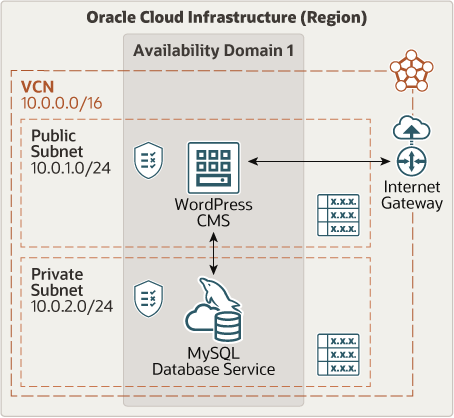

# oci-docker-wordpress-ssl

Cloned from [Oracle Quickstart](https://github.com/oracle-quickstart/oci-arch-wordpress-mds) and modified to:

- Support multiple WordPress sites

- Support SSL/HTTPS

- Use Oracle Cloud Infrastructure Always-Free eligible resources

## Prerequisites

- Permission to `manage` the following types of resources in your Oracle Cloud Infrastructure tenancy: `vcns`, `internet-gateways`, `route-tables`, `security-lists`, `subnets`, `mysql-family`, and `instances`.

- Quota to create the following resources: 1 VCN, 1 subnet, 1 Internet Gateway, 2 route tables, 3 security lists, and 1 compute instance that will run Docker and host the WordPress, MySQL, and Nginx containers.

## Deploy Using Oracle Resource Manager

1. Click [](https://cloud.oracle.com/resourcemanager/stacks/create?region=home&zipUrl=https://github.com/oraclesean/oci-docker-wordpress-ssl/releases/latest/download/oci-docker-wordpress-ssl-stack-latest.zip)

    If you aren't already signed in, when prompted, enter the tenancy and user credentials.

2. Review and accept the terms and conditions.

3. Select the region where you want to deploy the stack.

4. Follow the on-screen prompts and instructions to create the stack.

5. After creating the stack, click **Terraform Actions**, and select **Plan**.

6. Wait for the job to be completed, and review the plan.

    To make any changes, return to the Stack Details page, click **Edit Stack**, and make the required changes. Then, run the **Plan** action again.

7. If no further changes are necessary, return to the Stack Details page, click **Terraform Actions**, and select **Apply**. 

## Deploy Using the Terraform CLI

### Clone the Module

Clone this repo locally:

```
    git clone https://github.com/oraclesean/oci-docker-wordpress-ssl.git
    cd oci-docker-wordpress-ssl
```

### Prerequisites

Complete the pre-deploy setup detailed [here](https://github.com/cloud-partners/oci-prerequisites).

Create a `terraform.tfvars` file, and specify the following variables from your OCI environment:

```
# Authentication
tenancy_ocid         = "<tenancy_ocid>"
user_ocid            = "<user_ocid>"
fingerprint          = "<finger_print>"
private_key_path     = "<pem_private_key_path>"

# Region
region = "<oci_region>"

# Availablity Domain 
availablity_domain_name = "<availablity_domain_name>"

# Compartment
compartment_ocid = "<compartment_ocid>"

# MySQL DBSystem Admin Password 
admin_password = "<admin_password>"

# WordPress MySQL Database User Password
wp_password = "<wp_user_password>"

# WordPress Themes to be installed by WP-CLI (minimum 1 theme)
wp_themes = "lodestar,twentysixteen"

# WordPress Plugins to be installed by WP-CLI (minimum 1 plugin)
wp_plugins = "hello-dolly,elementor"

# WordPress Site Title
wp_site_title = "<WordPress_site_title>"
       
# WordPress WP-Admin User
wp_site_admin_user = "<wp-admin_user>"

# WordPress WP-Admin Password
wp_site_admin_pass = "<wp-admin_password>"

# WordPress WP-Admin e-mail address
wp_site_admin_email = "<wp-admin_email>"
````

### Create the Resources

Run the following commands:

````
terraform init
terraform plan
terraform apply
````

### Test the Deployment

After the deployment is finished, access WP-Admin using the wordpress_wp-admin_url output and pasting into web browser window. Verify initial content of your blog using the wordpress_public_ip:

````
wordpress_wp-admin_url = http://193.122.198.19/wp-admin/
wordpress_public_ip = 193.122.198.19
`````

### Destroy the Deployment

When you no longer need the deployment, run this command to destroy the resources:

    terraform destroy

## Architecture Diagram



## Reference Archirecture

For details of the architecture, see [_Set up a WordPress CMS connected to a MySQL database in the cloud_](https://docs.oracle.com/en/solutions/deploy-wordpress-cms-with-mysql-dbs/index.html)

## Additional references

- [_HTTPS for WordPress_](https://wordpress.org/support/article/https-for-wordpress/)

